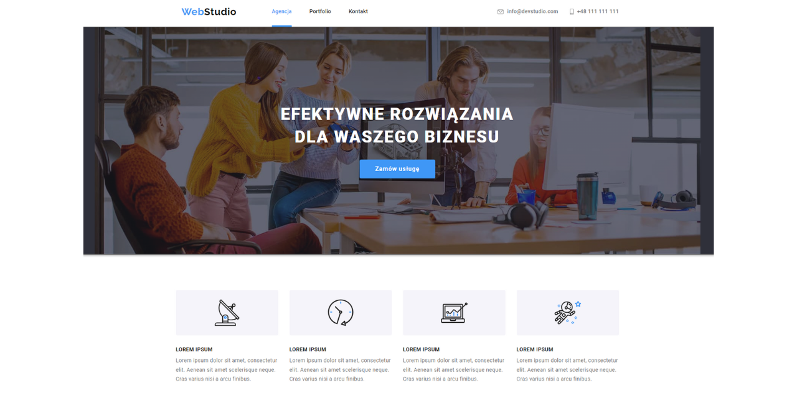

## goit-my-project-webstudio

# 🔷◾🔹"WebStudio"🔹◾🔷

## Table of contents

- [Project Title](#"webstudio")
- [Overview](#overview)
- [The Project](#the-project)
- [Technology stack](#technology-stack)
- [Links](#links)
- [Visuals](#visuals)
- [Project Status](#project-status)
- [Author](#author)

## Overview

### The Project

The project from 'Fullstack developer course at GoIT'.

A responsive, business website consisting of two parts: agency and portfolio pages.

### Technology stack

- HTML
- CSS
- SASS

### Links

- Source code repository URL: [Github](https://github.com/basiacarvalho/goit-webstudio)
- Live Site URL: [Live Demo](https://basiacarvalho.github.io/goit-webstudio/)

### Visuals

#### Desktop view :

### Project Status

- Completed (with the possiblity for future adaption)\
  The basic concepts of the project have been met, however further ideas may be implemented and added in the future.

### Author

👩‍💻 Barbara Carvalho

